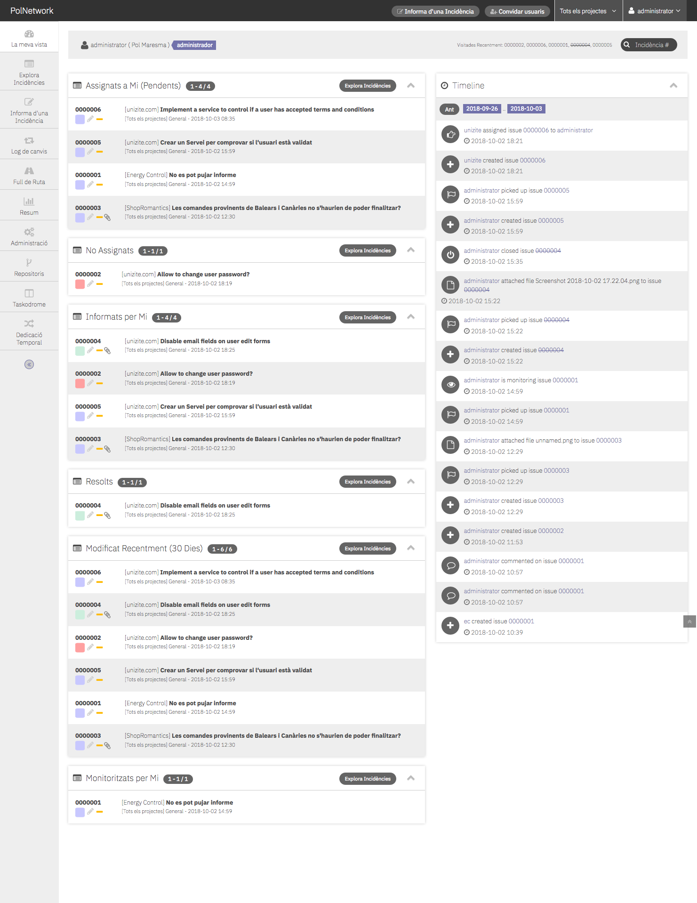

# Mantis Bugtracker Modern Theme

## About

I wanted a modern & clean theme for MantisBT. 
Based on https://github.com/Tagirijus/MantisBTDarkTheme

## Installation

Upload the whole folder into your `plugins/` folder in the mantis installation so that you e.g. have `MANTIS_INSTALLATION/plugins/MantisBTModernTheme/MantisBTDarkTheme.php`. After that the plugin should show up on the `manage_plugin_page.php` page in the mantis settings. There you can simply install it to activate it.